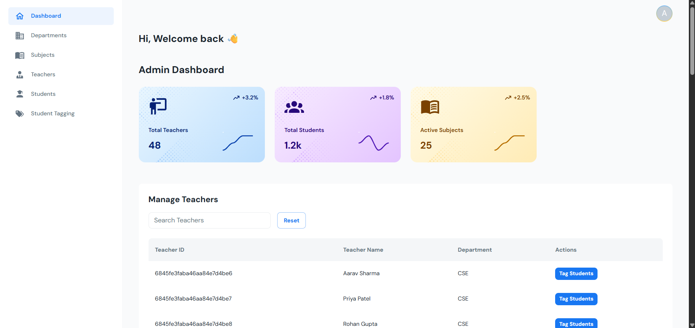

# CLO Management System

> A centralized **CLO Management System** built using **React**, **Vite.js**, and **Material-UI**. Features include table-based forms, real-time dashboards, and role-based access control for Admins, Coordinators, and Instructors.

---

## 🚀 Pages

- **Dashboard**
- **CLO Management**
- **Course Coordinators**
- **Instructors**
- **Reports & Visualization**
- **Authentication**
- **404 Not Found**

---

| Feature                | Description                                               |
| ---------------------- | --------------------------------------------------------- |
| Table-based Data Entry | Manage CLOs, marks, and evaluation using intuitive tables |
| React + Vite           | Blazing-fast frontend build system                        |
| Material-UI Components | Sleek and responsive design system                        |
| CSV Export             | Export data via `react-csv` integration                   |
| Responsive Dashboard   | Real-time CLO progress visualization using ApexCharts     |
| Role-based Access      | Customized dashboard experience for each user role        |
| GitHub Pages Ready     | Simple deployment with `gh-pages`                         |

📬 Contact
For questions or suggestions:

📧 Email: harshitstark01@gmail.com
